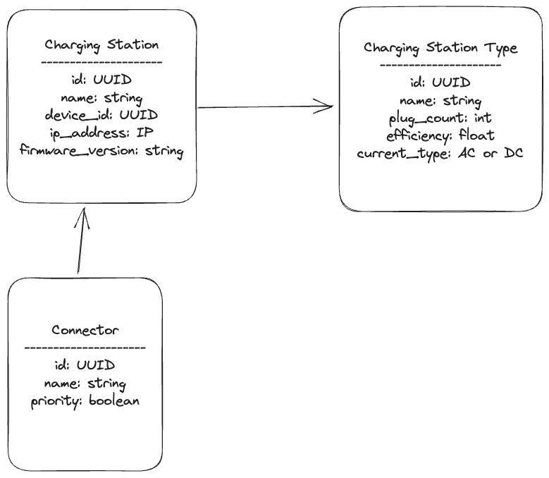

# Project Content
For a client in the mobility sector, implement a part of the system to support charging stations. The customer expects efficient operation of the charging station structure as well as depends on API security. The charging station has its own type, settings and places where the vehicle can connect to.

## Business functionality
- **Database Structure**.
    

- **Database**.
    - As in the figure above, define the database structure
    - 5 different types of charging station should be defined
    - Charging station should have as many connectors as defined in its type in plug_count field
    - There cannot be more than one connector with priority
    - The database should be located in the docker container

- **API**.
    - User should be able to add new elements separately, but with the given structure in mind
    - Each element should be modifiable, as well as the reading of a single or entire list
    - Pagination should be implemented
    - Filtering by selected logical elements should be implemented
    - The API should log to the standard output in order to know what is going on. Logs should be structured as [time [log_level] [context]]: msg

- **Security**.
    - The API should be implemented so that it is not accessible to everyone but only after obtaining a token
    - Tokens should be generated with timed access of 120s
    - When the token expires, a new one should be generated and the old one should be invalidated
    - A simple mechanism should be implemented to handle tokens - e.g. cache

- **Tests**.
    - Tests should cover the code as much as possible
    - A layer of integration tests should be implemented
    - Helper methods and APIs should be tested

- **Environment**.
    - The application should run in a container environment
    - Each component of the system should be put as a docker container
    - The application should have docker compose to run it with a single command
    - Variables needed for the project should not be hardcoded

## Technical requirements
- Typescript
- Web framework any
- Unit tests
- Prepared dockerfile and docker-compose
- Database we recommend PostgreSQL but can be any relational database
- Clean code recommended
- Design patterns welcome
- README with information for others on how to run the project and whatever is useful for the team
